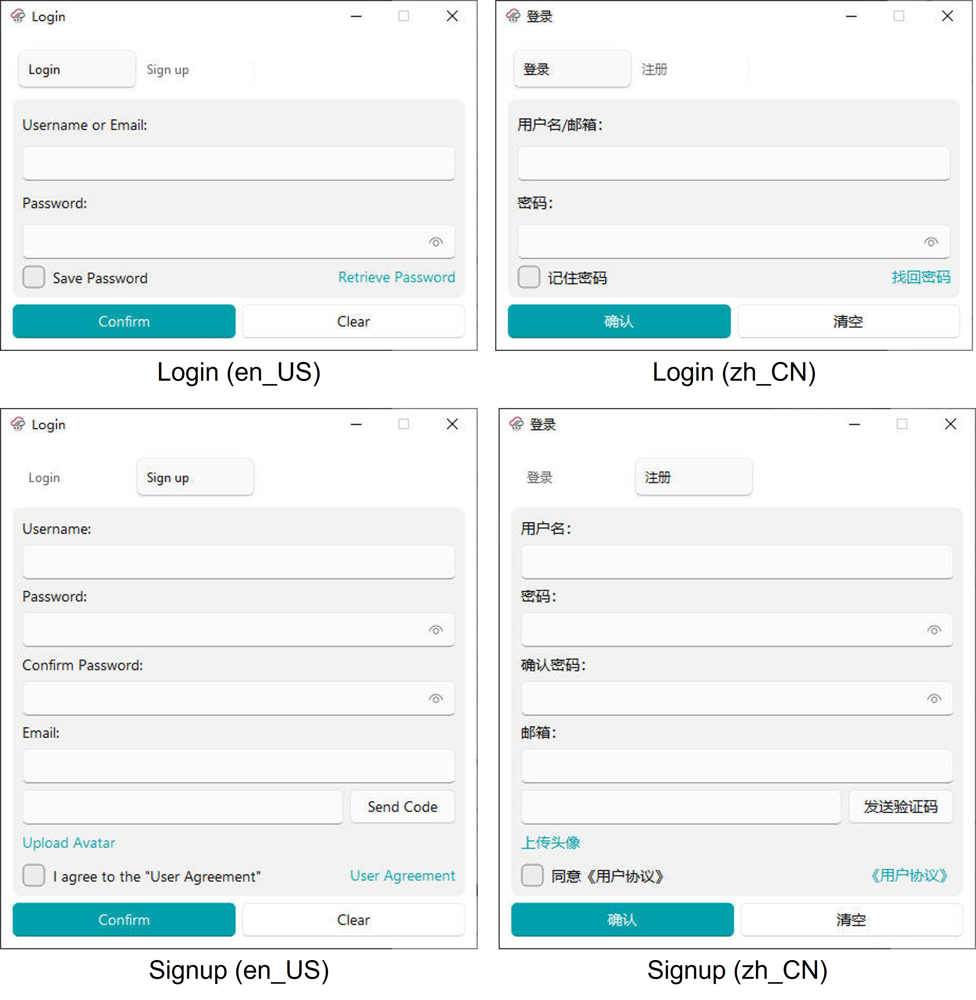

<div align="center">
    
</div>

<div align="center">

[](https://www.gnu.org/licenses/lgpl-3.0.html)
<!-- ALL-CONTRIBUTORS-BADGE:START - Do not remove or modify this section -->
[](#contributors-)
<!-- ALL-CONTRIBUTORS-BADGE:END -->

</div>

## Introduction

Welcome to use MuLingCloud. We aim to let everything easier.

MLCLogin-open is an open-source Python library base on [PyQt-Fluent-Widgets](https://github.com/zhiyiYo/PyQt-Fluent-Widgets). It is the login module for all MuLingCloud applications.

Current version: 0.1.4

Supported language: Chinese (zh_CN), English (en_US)

<details open>
<summary>Features</summary>

- **Login**
  - Supported login method
    - username + password + 2FA code (optional)
    - email + password + 2FA code (optional)
  - Support reset password via email
  - Support saving password in local

- **Signup**
  - Required fields: 
    - username
    - password
    - email (need verification)
  - Optional: uploading avatar

</details>

### Preview




## Installation
```bash
pip install -r requirements.txt -i https://pypi.org/simple
```

## Getting Started

Clone this repository to your local machine.

```bash
git clone https://github.com/mulingcloud/mlclogin_open.git
```

Modify configuration files to your own settings.

```toml
### config/backend.toml
## database settings
[database]
backend = "mysql"    # mysql or sqlite
name = "DATABASE NAME"
[database.connect]
# ...
host = "HOST"
port = 3306
username = "USERNAME"
password = "PASSWORD"
charset = "CHARSET"
# ...

## email settings
[email]
sender_name = "YourName"
[email.connect]
# ...
host = "smtp.example.com"
port  = 465
address = "example@example.com"
password = "PASSWORD"
# ...

## remote settings
[sftp.connect]
# ...
host = "example.com"
port = 22
user = "example"
password = "password"
remote_root = "example_dir/"
remote_platform = "linux"  # linux or windows
# ...
```

Then, run the demo to check if everything is set up correctly.

```bash
cd mlclogin_open/
python demo.py
```


## Changelogs

See all changes in [CHANGELOG](./CHANGELOG.md).


## Contributors

We appreciate all the contributors who add new features or fix bugs, as well as the users who offer valuable feedback.

We welcome all contributors, feel free to create an issue or file a pull request and join us! ❤️

<!-- ALL-CONTRIBUTORS-LIST:START - Do not remove or modify this section -->
<!-- prettier-ignore-start -->
<!-- markdownlint-disable -->
<table>
  <tbody>
    <tr>
      <td align="center" valign="top" width="14.28%"><a href="https://home.weimingchen.net/"><br /><sub><b>Weiming Chen</b></sub></a><br /><a href="https://github.com/mulingcloud/mlclogin_open/commits?author=wmchen" title="Code">💻</a> <a href="#ideas-wmchen" title="Ideas, Planning, & Feedback">🤔</a> <a href="#projectManagement-wmchen" title="Project Management">📆</a> <a href="https://github.com/mulingcloud/mlclogin_open/commits?author=wmchen" title="Tests">⚠️</a> <a href="#translation-wmchen" title="Translation">🌍</a></td>
    </tr>
  </tbody>
  <tfoot>
    <tr>
      <td align="center" size="13px" colspan="7">
        
          <a href="https://all-contributors.js.org/docs/en/bot/usage">Add your contributions</a>
        </img>
      </td>
    </tr>
  </tfoot>
</table>

<!-- markdownlint-restore -->
<!-- prettier-ignore-end -->

<!-- ALL-CONTRIBUTORS-LIST:END -->


## Contact

If you want to unlock full functionality, please contact me through [email](mailto:mulingcloud@yeah.net).

Office time: Asia/Shanghai, 9:00-18:00, Monday-Friday

Visit my homepage: https://www.weimingchen.net


## Acknowledgement

- [PyQt-Fluent-Widgets](https://github.com/zhiyiYo/PyQt-Fluent-Widgets): A fluent design widgets library based on C++ Qt/PyQt/PySide.
- [all-contributors](https://github.com/all-contributors/all-contributors): Automatically generate contributors list.


## License

This project is released under the [LGPLv3 license](https://www.gnu.org/licenses/lgpl-3.0.html).


## Repository

- [mlcbase](https://github.com/mulingcloud/mlcbase): The base module of all MuLingCloud applications or modules.
